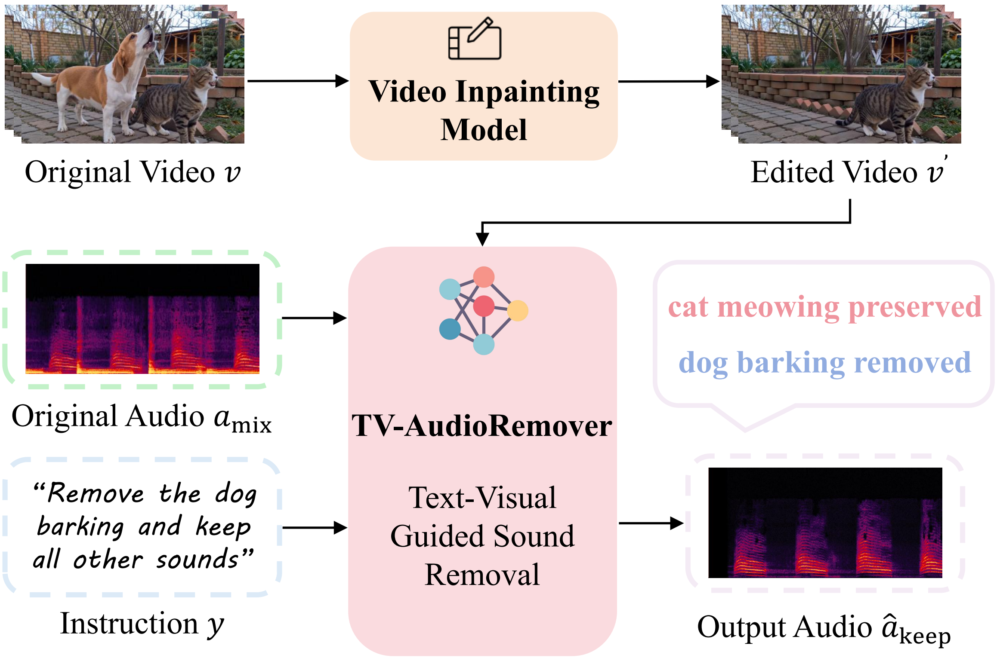
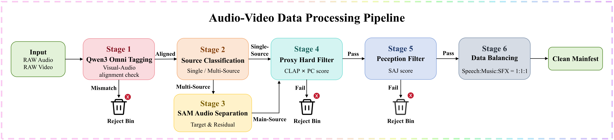
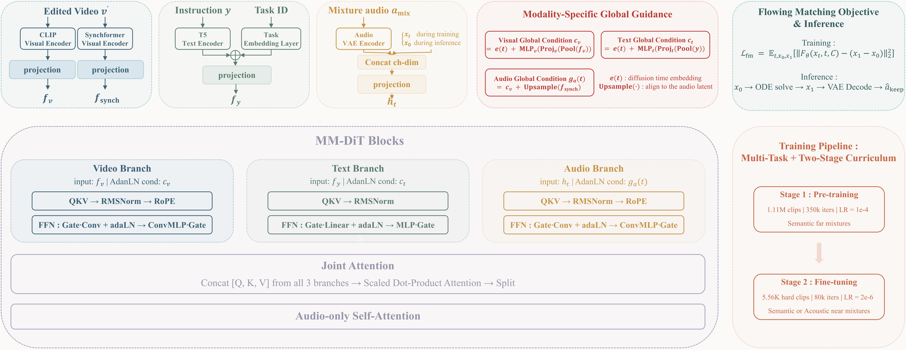

<div align="center">

# TV-AudioRemover: Joint Text‑Visual Guided Sound Removal with Multi‑Task Hard‑Mixture Curriculum

<p align="center">
  <a href="xxx" style="text-decoration:none"></a>
  &nbsp;
  <a href="https://github.com/PixCtrol/TV-AudioRemover" style="text-decoration:none"></a>
  &nbsp;
  <a href="https://yjx-research.github.io/TV-AudioRemover/" style="text-decoration:none"></a>
  &nbsp;
  <a href="xxx" style="text-decoration:none"></a>
</p>

</div>

<p align="center">
If you find this project useful, please consider giving a star ⭐️~
</p>


<div align="center">

<hr style="border: none; border-top: 3px solid #333; margin: 16px 0;">

### 👥 **Authors**

<div>
    <!-- Row 1: 6 authors -->
    <div style="margin-bottom: 2px;">
        Xinyue Guo<sup>*</sup>,&nbsp;
        Jianxuan Yang<sup>*†</sup>,&nbsp;
        Daiguo Zhou<sup>*</sup>
    </div>
    <!-- Row 2: 7 authors -->
    <div>
        Jiagao Hu,&nbsp;
        Yuxuan Chen,&nbsp;
        Fei Wang,&nbsp;
        Jian Luan
    </div>
</div>
<!-- Affiliations -->
<div>
    MiLM Plus, Xiaomi Inc.
    <br>
    *Equal contribution &nbsp;&nbsp; †Corresponding author
</div>
</div>

<hr style="border: none; border-top: 3px solid #333; margin: 16px 0;">

## 🎧 **Overview**

**TV-AudioRemover** is a target sound removal system tailored for audio-visual media requiring sound elimination. It leverages the visually edited video together with a natural-language instruction to suppress the sound associated with the removed visual object from the original audio mixture. Built on a multimodal diffusion Transformer (MM-DiT) with flow-matching, TV-AudioRemover generates cleaned audio at 44.1 kHz that removes the target sound while preserving the remaining audio.

<hr style="border: none; border-top: 3px solid #333; margin: 16px 0;">

## 🎨 **Tease Figure**

<div align="center">
    
    <p style="margin-top: 8px; text-align: center; font-style: italic;">
        Overview of the Visual-Text Guided Sound Removal framework TV-AudioRemover.
    </p>
</div>

<hr style="border: none; border-top: 3px solid #333; margin: 16px 0;">

## 🚀 **Key Features**

- **Visual-Text Guided Sound Removal** — Remove the sound of a visually deleted object using both the edited video and a text instruction for precise multimodal control.
- **Multi-Task Capability** — Supports extraction (keep target), deletion (remove target), and joint preserve-remove modes via generalized instruction modeling.
- **Plug-and-Play Design** — Works as a downstream audio remover accepting outputs from arbitrary visual object removal methods (SVOR, ROSE, EffectErase, UnderEraser, etc.).
- **Million-Scale Data Construction Pipeline** — A dedicated pipeline combining MLLM tagging (Qwen3-Omni), SAM Audio separation, and quality filtering (CLAP + SAJ) to construct high-quality single-object audio-visual aligned samples and synthesize task-specific mixture-target pairs.
- **AV-Remove-Bench** — The first audio-visual target removal benchmark with comprehensive scene diversity and broad acoustic coverage, equipped with dedicated objective metrics (TSSR, PSF) and an MLLM-based evaluation protocol.

<hr style="border: none; border-top: 3px solid #333; margin: 16px 0;">

## 📦 **Data Construction Pipeline**

<div align="center">
    
    <p style="margin-top: 8px; text-align: center; font-style: italic;">
        Data processing pipeline for constructing single-object audio-visual aligned samples.
    </p>
</div>

To acquire high-quality training data, we devise a pipeline to construct a million-scale dataset of single-object audio-visual aligned samples, from which we synthesize mixture-target pairs customized for model training.

**Stage 1 — MLLM Tagging**: Qwen3-Omni annotates each candidate with structured information (scene type, source multiplicity, sound category, main sounding-object label) and checks audio-visual correspondence. Mismatched samples are rejected.

**Stage 2 — Source Classification**: Aligned samples are divided into single-source and multi-source cases. Multi-source samples are processed by SAM Audio to separate the source corresponding to the main visual object.

**Stage 3 — Quality Filtering**: A proxy hard filter (CLAP × PC score) and a perceptual filter (SAJ score) ensure both semantic alignment and audio quality. Category balancing over speech, music, and sound effects yields the final clean manifest.

**Stage 4 — Mixture Synthesis**: For each clean sample A, semantically different interference clips B and optionally C are mixed with A to form two-source (A+B) and three-source (A+B+C) mixtures, generating three edit modes: *extract* (mixture = A+B(+C), output = A), *delete* (mixture = A+B+C, output = A+C, i.e., remove B and preserve the rest), and *both* (mixture = A+B, output = A).

<hr style="border: none; border-top: 3px solid #333; margin: 16px 0;">

## 📊 **AV-Remove-Bench**

We present **AV-Remove-Bench**, the first audio-visual target removal benchmark with comprehensive scene diversity and broad acoustic coverage. It contains 77 audio-visual clips (~6 seconds each) covering speech, music, and sound effects.

**Data Sources:**
- **Public datasets** — MUSIC-AVQA (music), AVSpeech (speech), Condensed Movies / AVSBench / VGGSound-test (sound effects)
- **Generated samples** — Seedance 2.0 with manually designed prompts spanning all three audio categories
- **Real recordings** — Daily real-world scenes focusing on sound-effect-centric object removal

**Scenario Types:**
- Multi-sounding-object scenes (two or more clearly distinguishable sounding objects)
- Foreground-target-plus-stable-background scenes (foreground target sound mixed with stable background ambience)

**Evaluation Protocol:**
- *Objective metrics*: Target Source Suppression Ratio (TSSR), Preserved Source Fidelity (PSF), IS, SAJ Overall, IB-AV, DeSync
- *MLLM-based judging*: Gemini 2.5 Pro scores four aspects (visual target removal, video fidelity, audio target removal, preserved audio fidelity) on a 1–5 scale

<hr style="border: none; border-top: 3px solid #333; margin: 16px 0;">

## 🧠 **Method Highlights**

<div align="center">
    
    <p style="margin-top: 8px; text-align: center; font-style: italic;">
        Architecture of the TV-AudioRemover multimodal diffusion Transformer.
    </p>
</div>

- **Task Tokens & Generalized Instructions**: Learnable task embeddings (extract / delete / both) combined with diverse natural-language templates improve instruction following and reduce prompt overfitting.
- **Modality-Specific Global Guidance**: Dedicated global conditions for visual, textual, and audio branches — the audio branch is modulated by the visual condition (positive cue about retained scene) rather than text.
- **Multi-Task Learning**: Joint training on extraction, deletion, and preserve-remove tasks enhances target-source localization and prevents over-removal.
- **Hard-Mixture Curriculum**: Fine-tuning with acoustically confusing mixtures (e.g., male vs. female voices, timbre-similar instruments) sharpens fine-grained discrimination.

<hr style="border: none; border-top: 3px solid #333; margin: 16px 0;">

## 📈 **Performance**

TV-AudioRemover achieves state-of-the-art performance on both objective and subjective metrics across audio-visual joint editing models and audio-editing models on AV-Remove Bench.

### Objective Evaluation

| Group | Method | IS ↑ | SAJ ↑ | TSSR ↑ | PSF ↑ | Instr. Comp.<sub>a</sub> ↑ | Fidelity<sub>a</sub> ↑ | IB-AV ↑ | DeSync ↓ |
|-------|--------|------|-------|--------|-------|----------------|------------|---------|----------|
| T-AV | AVI-Edit | 3.16 | 2.24 | 0.260 | 0.958 | 3.56 | 2.57 | 19.22 | 0.77 |
| T-AV | InstructAV2AV | 3.45 | 2.60 | -0.288 | 0.986 | 2.65 | 3.04 | 14.81 | 0.76 |
| T-A | ZETA | 3.27 | 2.95 | 0.571 | 1.054 | 3.69 | 3.22 | 18.71 | 0.75 |
| T-A | Audio-Omni | 2.15 | 2.20 | 0.496 | 0.901 | 4.39 | 1.68 | 8.23 | 1.13 |
| T-A | UNISON | 3.63 | 2.77 | -0.239 | 0.999 | 4.27 | 3.44 | 18.00 | 0.78 |
| VT-A | SAM Audio | 3.29 | 3.50 | 0.134 | 0.969 | 4.38 | 3.10 | 18.47 | 0.90 |
| VT-A | **TV-AudioRemover (Ours)** | **3.55** | **3.46** | **0.635** | **1.079** | **4.79** | **3.96** | **27.32** | **0.60** |

> Group: **T-AV** = audio-visual joint removal; **T-A** = audio-only editing (no visual condition); **VT-A** = visual-text conditioned audio-only editing.

### Human Subjective Evaluation

| Method | TRC ↑ | BP ↑ | TN ↑ | OQ ↑ | AC ↑ | ASR ↑ |
|--------|-------|------|------|------|------|-------|
| AVI-Edit | 0.51 | 0.32 | 0.35 | 0.35 | 39.37 | 21.43% |
| InstructAV2AV | 0.38 | 0.43 | 0.28 | 0.31 | 37.20 | 18.86% |
| ZETA | 0.42 | 0.63 | 0.55 | 0.55 | 53.36 | 36.69% |
| Audio-Omni | 0.48 | 0.24 | 0.20 | 0.19 | 30.75 | 11.69% |
| UNISON | 0.65 | 0.60 | 0.60 | 0.62 | 62.00 | 49.35% |
| SAM Audio | 0.86 | 0.83 | 0.89 | 0.88 | 85.72 | 81.58% |
| **TV-AudioRemover (Ours)** | **0.98** | **0.89** | **0.94** | **0.95** | **93.80** | **97.40%** |

> TRC = Target Removal Completeness, BP = Background Preservation, TN = Temporal Naturalness, OQ = Overall Quality, AC = Audio Composite Score, ASR = Audio Success Rate.

### Ablation Studies

**Training tasks**

| Setting | SAJ ↑ | TSSR ↑ | PSF ↑ | IB-AV ↑ | DeSync ↓ |
|---------|-------|--------|-------|---------|----------|
| Single-task training | 3.11 | 0.52 | 1.04 | 26.90 | 0.69 |
| **Multi-task training** | **3.46** | **0.64** | **1.08** | **27.32** | **0.60** |

**Training strategy**

| Setting | SAJ ↑ | TSSR ↑ | PSF ↑ | IB-AV ↑ | DeSync ↓ |
|---------|-------|--------|-------|---------|----------|
| Single-stage training | 3.22 | 0.48 | 1.05 | 25.17 | 0.62 |
| **Two-stage training** | **3.46** | **0.64** | **1.08** | **27.32** | **0.60** |

**Input modalities**

| Setting | SAJ ↑ | TSSR ↑ | PSF ↑ | IB-AV ↑ | DeSync ↓ |
|---------|-------|--------|-------|---------|----------|
| Text only | 3.46 | 0.63 | 1.07 | 25.02 | 0.63 |
| Visual only | 2.97 | -0.36 | 1.03 | 26.72 | 0.67 |
| **Visual + Text** | **3.46** | **0.64** | **1.08** | **27.32** | **0.60** |

**Upstream visual removers**

| Setting | SAJ ↑ | TSSR ↑ | PSF ↑ | IB-AV ↑ | DeSync ↓ |
|---------|-------|--------|-------|---------|----------|
| ROSE | 3.29 | 0.63 | 1.07 | 26.07 | 0.77 |
| EffectErase | 3.22 | 0.55 | 1.07 | 24.21 | 0.89 |
| UnderEraser | 3.23 | 0.58 | 1.07 | 26.12 | 0.75 |
| **SVOR** | **3.46** | **0.64** | **1.08** | **27.32** | **0.60** |

<hr style="border: none; border-top: 3px solid #333; margin: 16px 0;">

## 📝 **Citation**

If you find this repository useful, please consider citing our paper:

```bibtex
@misc{xxx,
  title={Cxxx}, 
  author={xxx},
  year={xxx},
  eprint={xxx},
  archivePrefix={arXiv},
  primaryClass={xxx},
  url={xxx}, 
}
```

<hr style="border: none; border-top: 3px solid #333; margin: 16px 0;">

## 🙏 **Acknowledgments**

This project uses the following datasets:<br>
VGGSound (<a href="https://creativecommons.org/licenses/by/4.0/" target="_blank" style="color:#007bff; text-decoration:none;">CC BY 4.0</a>), AudioSet (<a href="https://creativecommons.org/licenses/by/4.0/" target="_blank" style="color:#007bff; text-decoration:none;">CC BY 4.0</a>), AVSpeech (<a href="https://creativecommons.org/licenses/by/4.0/" target="_blank" style="color:#007bff; text-decoration:none;">CC BY 4.0</a>), Condensed Movies (<a href="https://creativecommons.org/licenses/by/4.0/" target="_blank" style="color:#007bff; text-decoration:none;">CC BY 4.0</a>), WavCaps (research-only), ACAVCaps (<a href="https://creativecommons.org/licenses/by-nc/4.0/" target="_blank" style="color:#dc3545; text-decoration:none;">CC BY-NC 4.0</a>), MUSIC-AVQA (<a href="https://creativecommons.org/licenses/by-nc/4.0/" target="_blank" style="color:#dc3545; text-decoration:none;">CC BY-NC 4.0</a>), and AVSBench (<a href="https://creativecommons.org/licenses/by-nc/4.0/" target="_blank" style="color:#dc3545; text-decoration:none;">CC BY-NC 4.0</a>).<br>
All resources are used for <strong>academic and non-commercial demonstration purposes only</strong>.

This project is inspired by the following works:<br>
[stable-audio-tools](https://github.com/Stability-AI/stable-audio-tools), [MMAudio](https://github.com/hkchengrex/MMAudio), [MMAudioSep](https://github.com/sony/mmaudiosep), [Make-An-Audio 2](https://github.com/bytedance/Make-An-Audio-2), [Synchformer](https://github.com/v-iashin/Synchformer), and [BigVGAN](https://github.com/NVIDIA/BigVGAN).<br>
Thanks for their contributions.

<hr style="border: none; border-top: 3px solid #333; margin: 16px 0;">

## 📞 **Contact**

If you have any questions or suggestions, please feel free to contact us at yangjianxuan@xiaomi.com.

<hr style="border: none; border-top: 3px solid #333; margin: 16px 0;">

<div align="center">

2026 TV-AudioRemover Project. All Rights Reserved.

</div>
